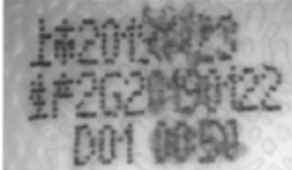
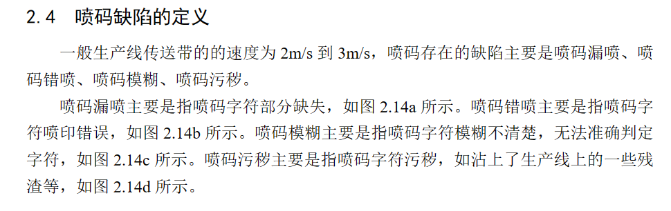
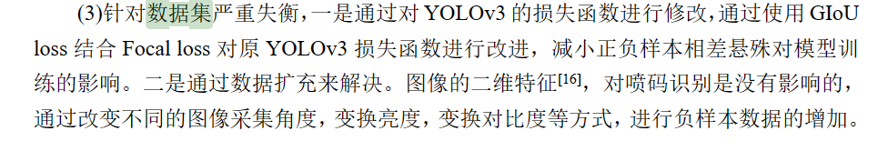
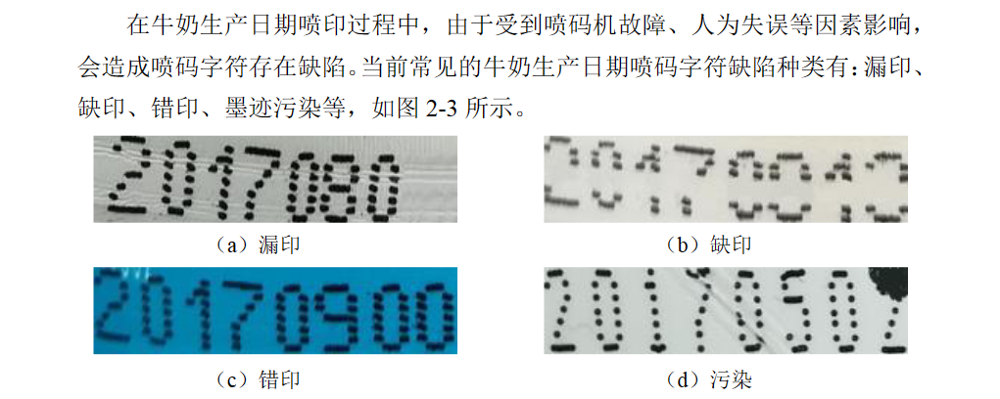
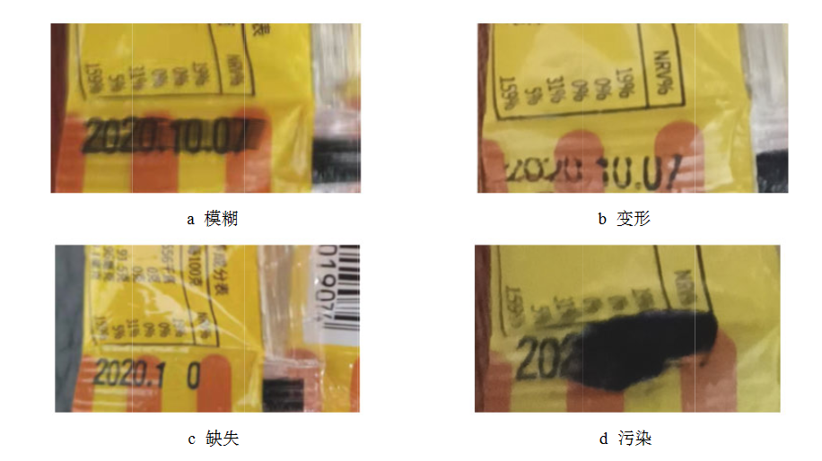
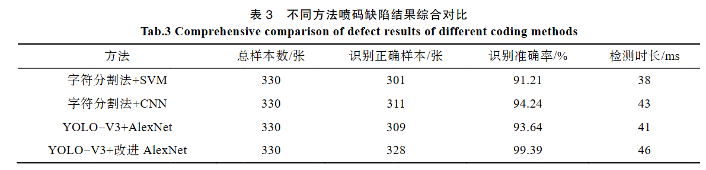
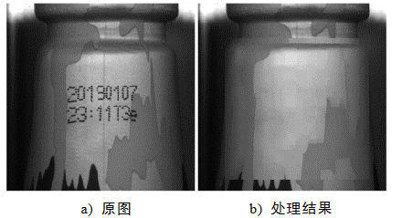
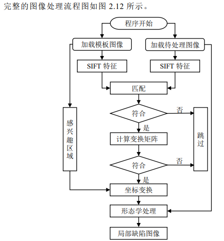

# Spurt-code-defect-detection（喷码缺陷检测）

## 瑕疵检测

### 瑕疵

在喷码位置确定一视野范围，以正常喷码样品视野内黑色面积为标准

* 漏喷

黑色覆盖面积小于正常喷码

* 喷码偏移

喷码超视野范围，视野内覆盖面积达不到标准要求

* 喷码模糊 

* 字符缺失

采用OCR（光学字符识别技术）对喷码内容进行提取，和预定字符进行对比

* 打花

### 文献知识

####  **基于图像处理的罐装瓶喷码缺陷检测** （ [基于图像处理的罐装瓶喷码缺陷检测 (wanfangdata.com.cn)](https://d.wanfangdata.com.cn/thesis/D02482422) ）

数据集获取：

数据规模：

 在数据集方面，针对训练集自建喷码数据集2500张，其中喷码正常 800 张，其余三种缺陷每类各 400 张，外加 500 张各种倾斜角度的图像；针对测试集采集 2000 张，并在训练集中随机抽取了 500 张，共 2500 张图像作为测试集 

#### 基于计算机视觉的牛奶生产日期喷码字符缺陷检测技术研究

#### 基于机器视觉的柔性包装袋喷码缺陷检测研究

方法：

####  应用于饮料包装的复杂背景喷码质量检测方法 

数据： 结合==局部缺陷图像生成算法==自动生成 了不合格喷码图像 

喷码质量检测： 提出了一个用于喷码质量检测的轻量化特征提取网络——CodeNet，结合经典的SSD算法 （ 先采用深度学习的方法获得单个字符的信息， 然后对字符特征进行检测，进而获得喷码质量检测结果。 ）

Why 不直接端到端检测每个字符是否有缺陷：需要很多的训练数据，而且检测的准确率也很难达到工业应用级别 。先识别字符后检测喷码质量的设计可以在保持高效检测的同时拥有极高的准确率 

* 基于目标检测方案（找到每一个字符的位置及其所属类别，然后判断字符是否存在缺陷）  

（1）两阶段算法——基于候选区域

R-CNN,Faster R-CNN,先利用某些候选区域方法产生目标候选框，再判断候选框是否包含要检测的目标（检测效果好，尤其在小目标检测方面，但是速度相比一阶算法慢很多）

(2) 一阶段算法——基于回归的检测算法

YOLO,SSD   先提取候选区域然后再预测进一步判断候选区域包含哪个目标类别。一阶段算法直接通过回归的方式，只计算一次既得出目标边界框坐标，又得出每种类别的概率。

YOLO：主要思想是整幅图像只看一次，把候选框的提取和分类集成到一个网络当中。最显著特点：快（精度上降低）

SSD:利用YOLO优势，在预测时使用回归的方式执行计算，然后又向两阶段算法的候选区域机制学习，在图像的每个位置上都生成了若干不同大小和边长比例的边界框。

* 基于文本识别（先使用文本识别算法识别喷码字符，然后检测字符特征）

文本识别：先使用改进的通用目标检测算法检测出包含文本的区域，即==文本行==，然后将这些文本行送入==文本序列识别器==识别出相应的文本。

* 数据集获取：

图片采集： 直接从饮料生产企业流水线上采集过来的 （采集不同日期数据，对于喷码不合格的图片，单独分拣）筛选976张作为训练，474作为测试

 喷码图像分类 ： 正常喷码、重复喷码、喷码完全缺失和部分缺失、单字符缺失、 时间错误 

 图片裁剪 ： 主要的裁剪区域
尺寸为384×384，随机加入 320×320 和 448×448 两种尺寸。每一张图片都会进行随机裁剪，并且确保一定包含完整喷码区 

* 缺陷图像生成(主要生成单字符缺失的缺陷图像，以便模型可以训练不同大小的字符):

==形态学处理==：

腐蚀和膨胀

检测的喷码为黑色点阵字符，背景相对较浅，因此使用膨胀操来处理喷码图像 

 基于SIFT 特征匹配的局部缺陷生成算法 

* 图片标记

是否合格，标签有哪些文字，每个字符坐标

 基于 Python 和 Opencv 编写了一款标记软件，用于标记喷码图片 ： 可以先标完一张图片上的所有字符，然后统一打标签，加快了标记速度 

 ==最终的数据集包含 2931 张训练图片、711 张测试图片== ， 先将图片和标签数据转换成 VOC2007 格式的数据集，然后再转成 TFRecord 

