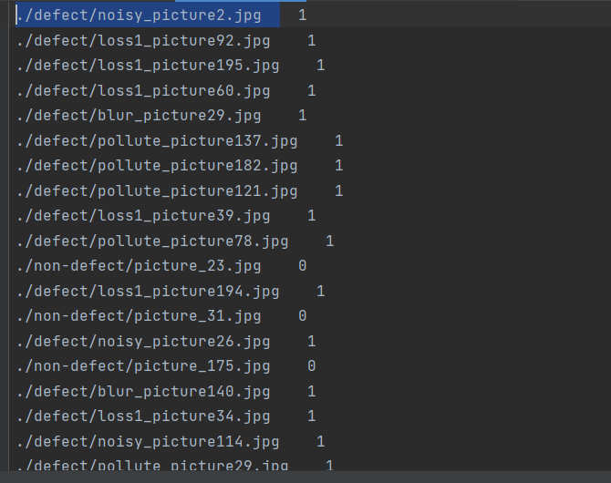
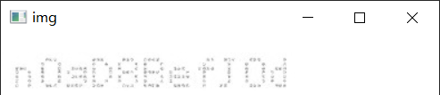

# 使用paddlex提供的mobilenetv3_small

## 参考paddle提供——蔬菜分类
<https://github.com/PaddlePaddle/PaddleX/blob/develop/docs/quick_start_API.md>

###  一、定义训练/验证图像处理流程transforms
代码在train_transforms中加入了RandomCrop和RandomHorizontalFlip两种数据增强方式            
> train_transforms = T.Compose(
>     [T.RandomCrop(crop_size=224), T.RandomHorizontalFlip(), T.Normalize()])
> 
> eval_transforms = T.Compose([
>     T.ResizeByShort(short_size=256), T.CenterCrop(crop_size=224), T.Normalize()
> ])


###   二、定义dataset加载图像分类数据集

数据集格式




训练集

> train_dataset = pdx.datasets.ImageNet
> 
>    data_dir='vegetables_cls',
>
>    file_list='vegetables_cls/train_list.txt',
> 
>    label_list='vegetables_cls/labels.txt',
> 
>    transforms=train_transforms,
> 
>    shuffle=True)
                     

测试集   

> eval_dataset = pdx.datasets.ImageNet(
> 
>    data_dir='vegetables_cls',
> 
>    file_list='vegetables_cls/val_list.txt',
> 
>    label_list='vegetables_cls/labels.txt',
> 
>    transforms=eval_transforms)


### 三、模型加载
> num_classes = len(train_dataset.labels)
> 
> model = pdx.cls.MobileNetV3_small(num_classes=num_classes)

使用百度基于蒸馏方法得到的MobileNetV3预训练模型，模型结构与MobileNetV3一致，但精度更高

###  四、使用MobileNetV3_small模型开始训练

> model.train(num_epochs=10,
> 
> train_dataset=train_dataset,
> 
> train_batch_size=32,


### 五、具体训练流程在train.py
```
import paddlex as pdx
from paddlex import transforms as T


pdx.utils.decompress('data.tar.gz')

# 定义训练和验证时的transforms
# API说明：https://github.com/PaddlePaddle/PaddleX/blob/develop/docs/apis/transforms/transforms.md
train_transforms = T.Compose(
    [T.RandomCrop(crop_size=224), T.RandomHorizontalFlip(), T.Normalize()])

eval_transforms = T.Compose([
    T.ResizeByShort(short_size=256), T.CenterCrop(crop_size=224), T.Normalize()
])

# 定义训练和验证所用的数据集
# API说明：https://github.com/PaddlePaddle/PaddleX/blob/develop/docs/apis/datasets.md
train_dataset = pdx.datasets.ImageNet(
    data_dir='data',
    file_list='data/train_list.txt',
    label_list='data/labels.txt',
    transforms=train_transforms,
    shuffle=True)
eval_dataset = pdx.datasets.ImageNet(
    data_dir='data',
    file_list='data/val_list.txt',
    label_list='data/labels.txt',
    transforms=eval_transforms)

# 初始化模型，并进行训练
# 可使用VisualDL查看训练指标，参考https://github.com/PaddlePaddle/PaddleX/blob/develop/docs/visualdl.md
num_classes = len(train_dataset.labels)
model = pdx.cls.MobileNetV3_small(num_classes=num_classes)

# API说明：https://github.com/PaddlePaddle/PaddleX/blob/develop/docs/apis/models/classification.md
# 各参数介绍与调整说明：https://github.com/PaddlePaddle/PaddleX/tree/develop/docs/parameters.md
model.train(
    num_epochs=10,
    train_dataset=train_dataset,
    train_batch_size=32,
    eval_dataset=eval_dataset,
    lr_decay_epochs=[4, 6, 8],
    learning_rate=0.01,
    save_dir='output/mobilenetv3_small',
    use_vdl=True)
```

### 六、训练过程
训练过程中，模型在训练集和验证集上的指标均会以标准输出流形式输出到命令终端。
当用户设定use_vdl=True时，也会使用VisualDL格式将指标打点到save_dir目录下的vdl_log文件夹，
在终端运行如下命令启动visualdl并查看可视化的指标变化情况。
> visualdl --logdir output/mobilenetv3_small --port 8001

training_loss

_%20loss.png)

training_acc1

_%20acc1.png)

eval_acc1

_%20acc1.png)

包括acc2等可视化指标,保存在log文件夹中

### 七、加载训练保存的模型预测
```commandline
import paddlex as pdx
import cv2

model = pdx.load_model('output/mobilenetv3_small/best_model')
result = model.predict('data/defect/noisy_picture2.jpg')

print(result)

img = cv2.imread('data/defect/noisy_picture2.jpg')
cv2.imshow('img', img)
key = cv2.waitKey(0)
```
输出结果
> 2023-04-25 10:43:58 [INFO]	Model[MobileNetV3_small] loaded.
> 
> [{'category_id': 1, 'category': 'defect', 'score': 0.98298806}]
> 
> 这是一张加入噪声的模糊图片，预测结果为有瑕疵

> 

## 后续
1.图片比较单一，可以加入背景等再进行训练

2.在我们自己生成的数据中表现比较好，还未测试在真实图片上的预测效果

3.训练参数还可以自己调整

4.得到模型后还可以进行量化和裁剪以及导出

## 问题
1.paddlex直接提供了mobilenetv3的api，没有展示网络细节，后期不知道怎么改良网络结构，
但是我有一个pytorch实现的mobilenetv3模型，具体网络结构已经了解

关于mobilenetv3的详解<https://blog.csdn.net/DL_wly/article/details/90168883>


